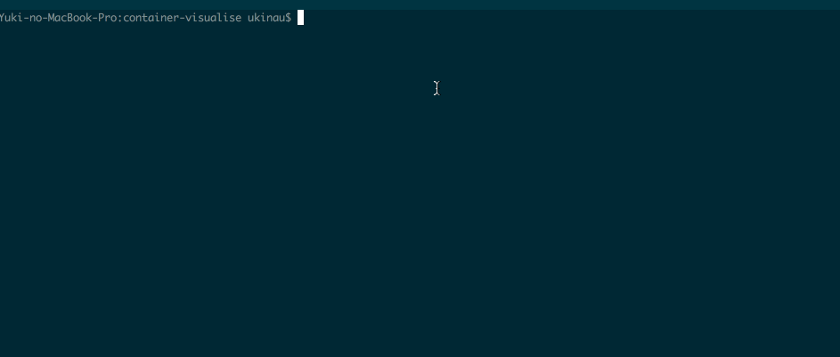
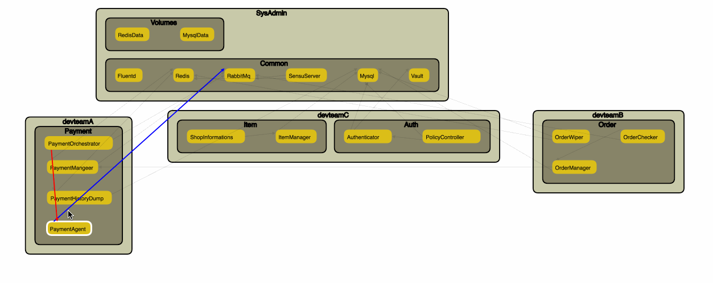

# Docker compoe container visualisation tools
## Current Release 0.5
### 1. Generate the graph data from docker-compose file by using python program

### 2. Just opened test.html with your browser

